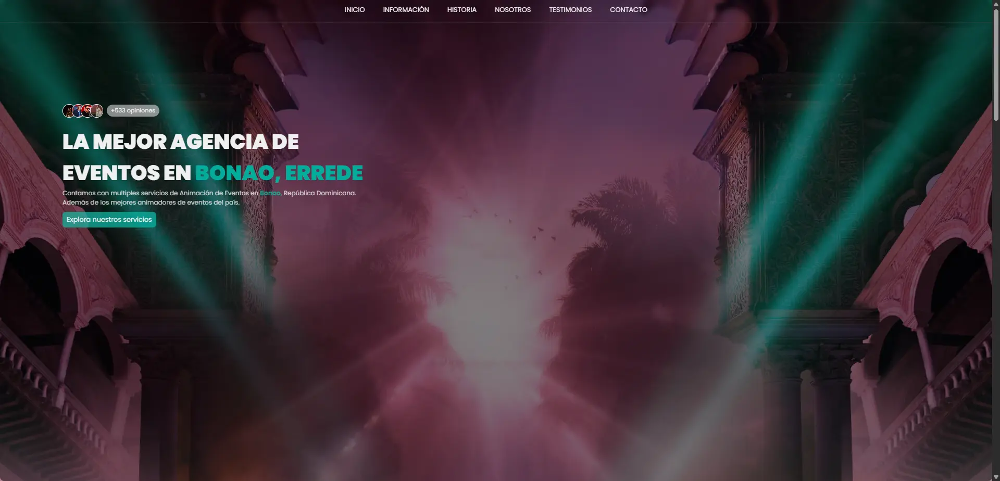

# 🌸 MIKASU ANIMATION EVENTS 🌸 - Sitio Web Oficial

Este proyecto es una simulación de una 'empresa' dedicada a la animación de eventos con mariachis, alquiler de bocinas y demás. Es parte de tantos proyectos de la carrera de Bachiller de Informática en Programación d [@Jendry Abreu](https://www.instagram.com/de1eonzz). Sitio web desarrollado con mucho amor por [tuerre](https://tuerre.dev) (Jendry).

# 📝 Licencia del Proyecto

Ten en cuenta que este proyecto es de código abierto y abierto a contribuciones de la comunidad pero **su licencia no permite trabajos derivados, ni gratuitos ni comerciales**.

# 🛠️ Tecnologías

- [HTML](https://astro.build)
- [CSS](https://tailwindcss.com)
- [Vanilla Javascript](https://tailwindcss.com)

> **Hecho sin frameworks ni librerias por requerimientos del maestro**. ☹️

## 🤝 Contribuciones

Este proyecto fué hecho en solitario por [Jendry Abreu](https://www.instagram.com/de1eonzz) y **commitiado desde otras maquinas y usuarios por si mismo**.

tysm 4 read. happy coding! 💜